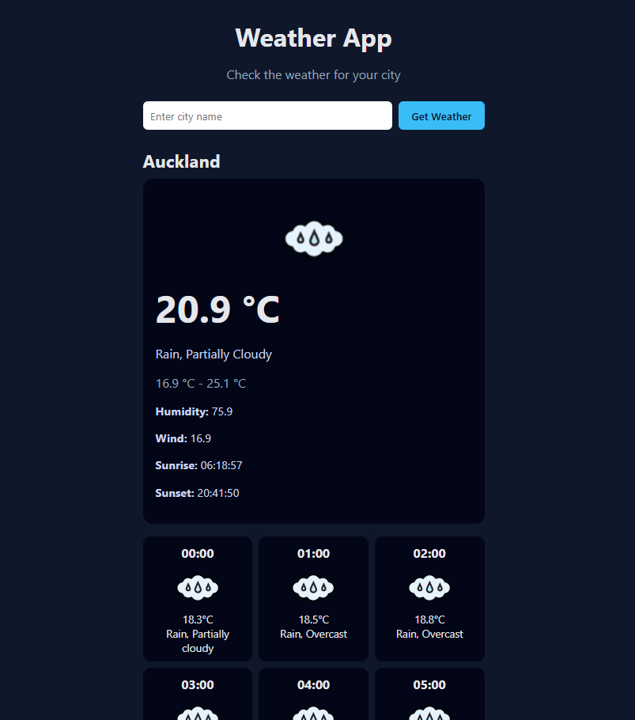

# Weather App

This is a personal project built to create a **weather application** using JavaScript modules.  
The goal was to practice **API integration, asynchronous JavaScript, and DOM manipulation** while building a responsive app that displays current and hourly weather for a user-specified city.

---

## Live Demo

Try the project live here: [Weather App Demo](https://jeraych.github.io/TOP-Weather/)

---

## Screenshots

### Home Page


---

## Features

- **Search form** to input any city and fetch weather data.
- **Current weather display** showing temperature, conditions, humidity, wind, sunrise, and sunset.
- **Hourly forecast** with icons and temperature for each hour.
- Loading spinner shows while fetching data from the API.
- Metrics: °C, km/h, mm, hPa.
- Fully responsive layout for desktop and mobile.
- Dynamic DOM creation using JavaScript modules.
- Uses **Webpack** for module bundling and asset management.

---

## Project Structure

- `index.html` – main HTML container.
- `style.css` – global styling for layout, loader, icons, and hourly forecast.
- `index.js` – entry point, handles form submission, event listeners, and orchestrates API calls and rendering.
- `api.js` – fetches weather data from Visual Crossing API and processes it.
- `dom.js` – creates DOM elements for current and hourly weather.
- `screenshots/` – folder containing screenshots for documentation.

> Note: JavaScript modules were manually written to practice modular coding, while HTML and CSS structure was assisted by ChatGPT for clean layout and responsiveness.

---

## Usage

1. Clone the repository:

```bash
git clone https://github.com/Jeraych/TOP-Weather.git 
cd TOP-Weather
```

2. Install dependencies:

```bash
npm install
```

3. Start development server (Webpack Dev Server will open your site in the browser):

```bash
npm start
```

- Edit files in `src/` and the browser will auto-refresh.

4. Build production-ready files:

```bash
npm run build
```

- This generates a `dist/` folder containing the bundled app ready for deployment.

---

## License
This project is licensed under the **MIT License**. See the [LICENSE](LICENSE.txt) file for details.

---

## Acknowledgements
- [The Odin Project](https://www.theodinproject.com/lessons/node-path-javascript-weather-app) – course inspiration.
- Visual Crossing Weather API – weather data.
- ChatGPT – assisted with modular code patterns, DOM rendering, and styling suggestions.
